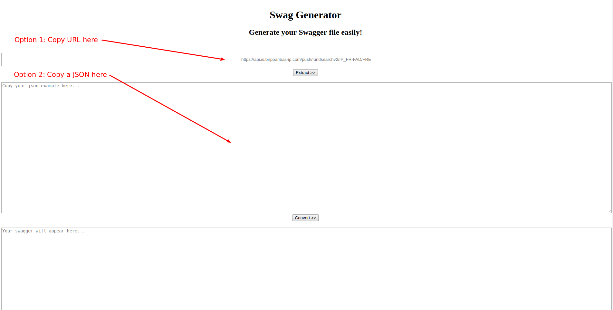
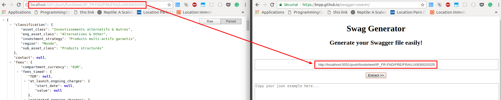
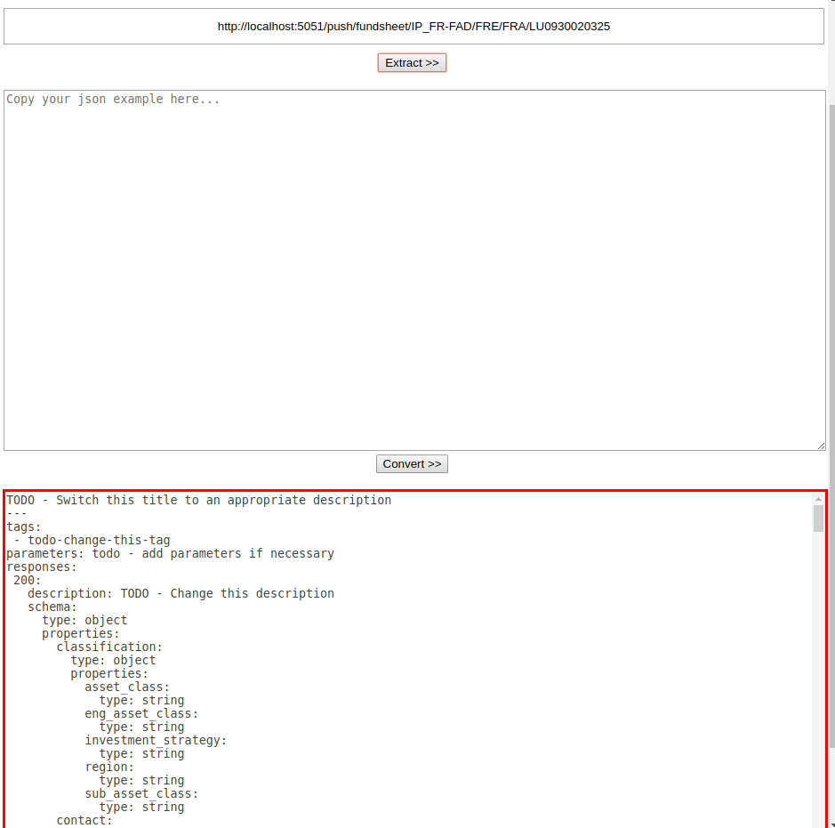
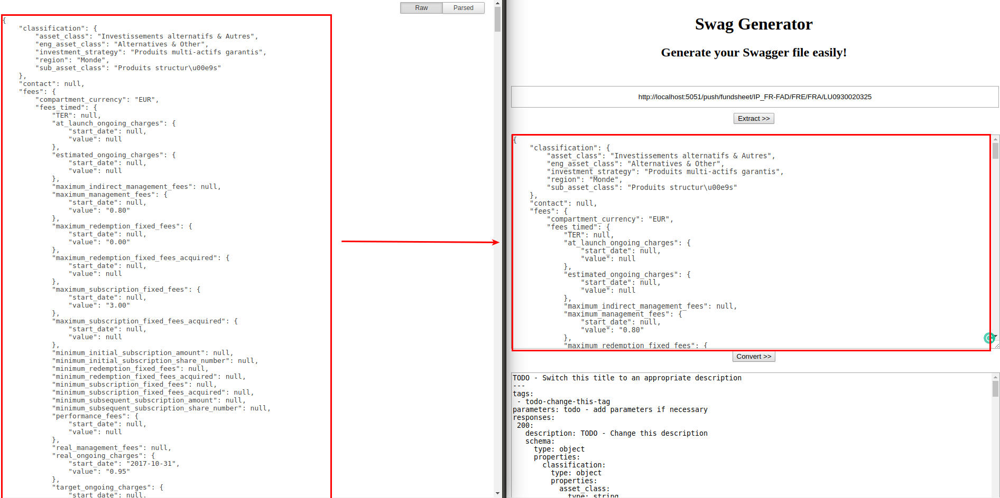
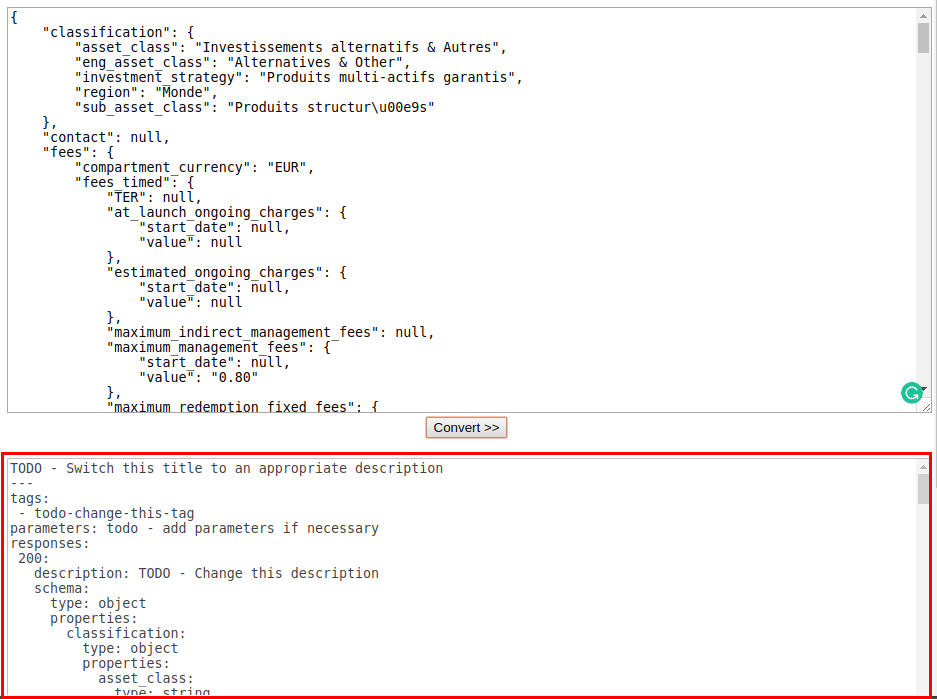

# Automatically generate Swagger file

When creating a new route on the APIs, you have to document it with a Swagger file. This can be exhausting when a heavy route: this tool aims at easing the process.

## Get to the Page

Go to the [Github Page](https://bnpp.github.io/swagger-coverer).

There are two options to generate the `yml` file:
  - Insert an URL to call (for GET requests)
  - Copy-paste a JSON response

Let's explore both solutions.

## Option 1: Get Swagger from URL

This option is useful when handling classic GET requests.

1. Copy-paste your `localhost` (or `api.staging.bnpparibas-am.com`) in the first rectangle. For example, on the route `/fundsheet` of push-admin:

  

2. Click on Extract button right below

3. The doc is generated in the bottom rectangle.

  

4. `TODO` are inserted where an action is needed. It is because:
  - it needs a description or a tag specific to the route
  - the variable was `null`, an empty array or an empty dict: the type couldn't be inferred. You need to check manually.

## Option 2: Get Swagger from JSON

This option is useful to write the return body of a POST request (as URL only support GET requests).

1. Copy-paste the JSON in the second rectangle.

  

2. Click on Convert button right below

3. The doc is generated in the bottom rectangle.

  

4. `TODO` are inserted where an action is needed. It is because:
  - it needs a description or a tag specific to the route
  - the variable was `null`, an empty array or an empty dict: the type couldn't be inferred. You need to check manually.
